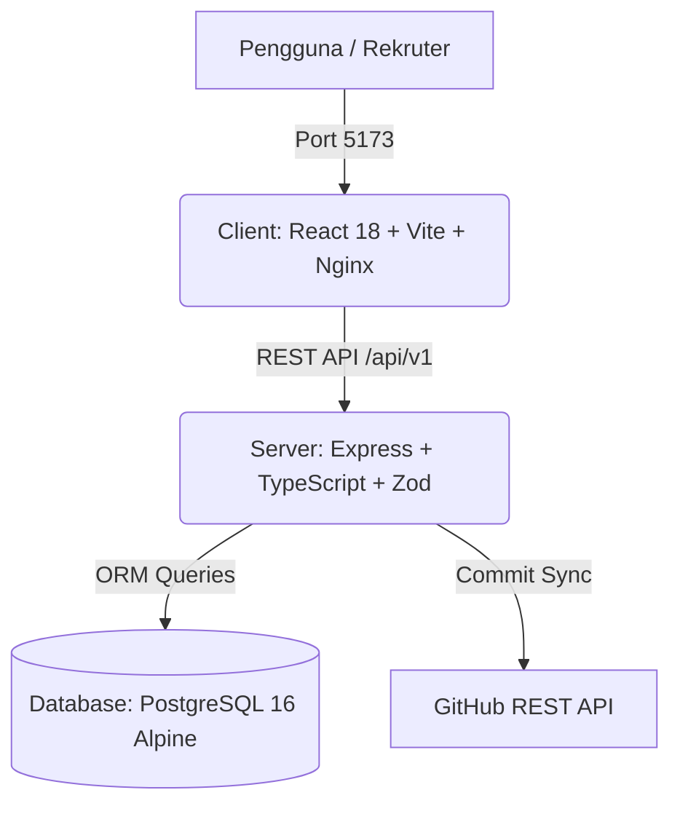

# ⚡ Logfolio — Proof-of-Skill Portfolio Generator

<div align="center">

[](docker-compose.yml)
[](client/)
[](client/)
[](server/)
[](server/prisma/)
[](server/prisma/)

<p align="center">
  <b>Platform mikro-jurnal berbasis pembuktian kerja (*proof-of-work*) yang secara otomatis mengonversi kebiasaan mencatat harian (1–2 menit per hari) menjadi portofolio interaktif, modern, dan terverifikasi untuk rekruter.</b>
</p>

[Fitur Utama](#-fitur-unggulan) •
[Arsitektur](#-arsitektur-sistem) •
[Mulai Cepat](#-panduan-instalasi--menjalankan) •
[Dokumentasi](#-dokumentasi-proyek) •
[Aturan Pengkodean](#-standar-pengkodean-agentsmd)

</div>

---

## ✨ Fitur Unggulan

| Modul Fitur | Deskripsi | Status |
| :--- | :--- | :---: |
| ⚡ **Recruiter Executive Snapshot** | Ringkasan screening 10-detik berisi top skills, streak konsistensi, dan sorotan karya | ✅ Siap |
| 🛡️ **Stealth Mode (NDA Protection)** | Penyamaran detail sensitif & tautan internal untuk proyek di bawah NDA | ✅ Siap |
| 🔄 **Live GitHub Auto-Sync** | Pengambilan commit GitHub secara real-time langsung ke Quick Log Composer | ✅ Siap |
| 📬 **Masked Recruiter Contact Relay** | Form kontak anti-spam dengan relay aman langsung ke database kandidat | ✅ Siap |
| 📥 **Dashboard Recruiter Inbox** | Panel membaca dan merespons pesan rekruter langsung dari dashboard | ✅ Siap |
| 📄 **One-Click ATS & PDF Resume** | Ekspor format cetak khusus A4/PDF, Markdown, dan JSON dengan beragam template | ✅ Siap |
| 📊 **Engineering Rhythm Heatmap** | Visualisasi aktivitas harian timezone-aware ala kontribusi GitHub | ✅ Siap |
| 🤖 **AI Summary & Weekly Digest** | Generator rangkuman performa mingguan otomatis dengan opsi dwibahasa (ID/EN) | ✅ Siap |

---

## 🏗️ Arsitektur Sistem



### Topologi Port & Layanan
- **Frontend Client**: [http://localhost:5173](http://localhost:5173) (Container: `logfolio_client`)
- **Backend API**: [http://localhost:5000](http://localhost:5000) (Container: `logfolio_server`)
- **PostgreSQL**: `localhost:5432` (Container: `logfolio_postgres`)

---

## 🚀 Panduan Instalasi & Menjalankan

### 1. Prasyarat
- [Docker](https://www.docker.com/) & Docker Compose terpasang di sistem.
- Node.js v20+ (opsional, jika ingin dev lokal tanpa container).

### 2. Menjalankan Seluruh Stack via Docker (Rekomendasi)
```bash
# Jalankan database, backend server, dan frontend client
docker compose up -d

# Periksa status kesehatan container
docker ps
```

### 3. Sinkronisasi & Seeding Database Awal
```bash
# Masukkan data seed profil nyata (Firli-stack & Proyek ASA ERP)
docker exec logfolio_server npx tsx prisma/seed.ts
```

---

## 📚 Dokumentasi Proyek

| Dokumen | Lokasi | Cakupan Konten |
| :--- | :--- | :--- |
| **Aturan Agent & Kode** | [`AGENTS.md`](AGENTS.md) | Standardisasi AI, arsitektur Docker, type safety, dan strict clean code |
| **Spesifikasi PRD & SRS** | [`docs/PRD_SRS_Portfolio_Generator_v2.md`](docs/PRD_SRS_Portfolio_Generator_v2.md) | Spesifikasi kebutuhan fungsional (FR) & non-fungsional (NFR) lengkap |
| **Sistem Desain & UI/UX** | [`docs/DESIGN_SYSTEM_SPEC.md`](docs/DESIGN_SYSTEM_SPEC.md) | Token warna WCAG AAA, glassmorphism, tipografi, dan print stylesheet |
| **Panduan Frontend** | [`client/README.md`](client/README.md) | Panduan modul client, struktur komponen, dan panduan styling |

---

## 💎 Standar Pengkodean (`AGENTS.md`)

Seluruh kontributor dan agen AI wajib mematuhi aturan baku di [`AGENTS.md`](AGENTS.md):
1. **Zero Teks Hijau / Tanpa Komentar**: Seluruh kode harus *self-explanatory* tanpa baris komentar `// ...` atau `/* ... */`.
2. **ESM Import Path**: Backend Express wajib menyertakan ekstensi `.js` pada setiap import lokal.
3. **Strict Type Safety**: Nol kompromi terhadap `any` implisit; semua props dan model data bertipe ketat.
4. **Vanilla CSS Glassmorphism**: Menggunakan token CSS yang telah ditentukan tanpa utilitas Tailwind ad-hoc.
